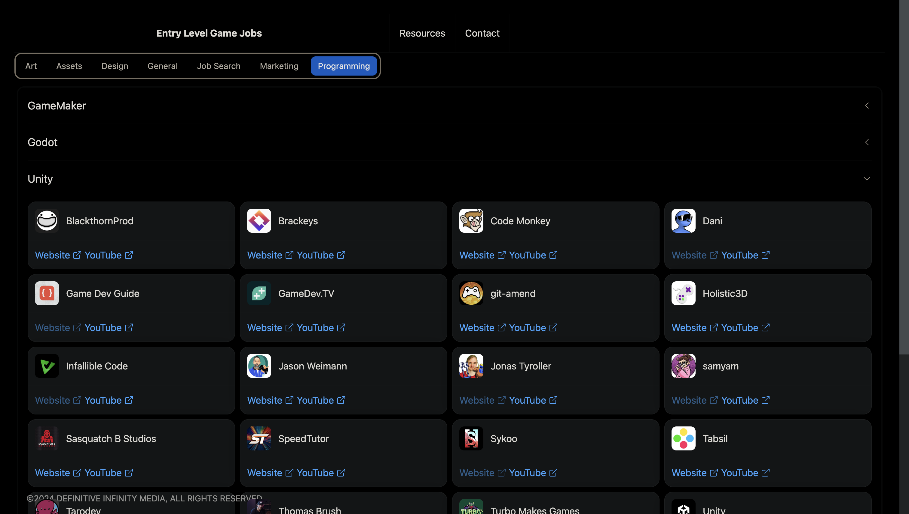

<!--
Original source code from:
https://github.com/codeSTACKr/codeSTACKr
-->

# Hi there, I'm Noah! 👋

---
## About Me 🚀

I'm a passionate Game Developer with experience in Unity. I love tackling complex problems, learning new skills, and collaborating with diverse teams to create innovative solutions.

- Founder at [Definitive Infinity Media](https://www.definitiveinfinitymedia.com/)
- 🔭 Unity and Unreal Engine Developer
-  👨‍💻 Love working and prototyping on new games and ideas
-  🤝 Currently working with a small indie team on a metroidvania
- ⚡Avid gamer, musician, and Eagle Scout
- 🌱 I’m currently learning **graphics programming and UE5**
---
## My Skills 🧠

<!-- *Replace the above skill badges with your own skills and expertise. To create more badges, use [checkout this repo](https://github.com/alexandresanlim/Badges4-README.md-Profile).* -->
<!-- https://github.com/alexandresanlim/Badges4-README.md-Profile -->
---

## Favorite Tools 🔧

<!-- *Replace the above skill badges with your own skills and expertise. To create more badges, use [checkout this repo](https://github.com/alexandresanlim/Badges4-README.md-Profile).* -->
<!-- https://github.com/alexandresanlim/Badges4-README.md-Profile -->
---

## Featured Projects 💻

### [V.A.T.S. in Unity 6]([https://www.entrylevelgamejobs.com/](https://youtu.be/56GUHTq-dRA?si=i63BLJH3uy4Wt1My))

With the Fallout TV show out, I decided to recreate a mechanic from one of my favorite games in Unity 6 in a week. It may be flawed, but this is the result!

### [Entry Level Game Jobs](https://www.entrylevelgamejobs.com/)

EntryLevelGameJobs is a website built with React and Azure. This project is still a work in progress, but is a website designed to help anyone interested in getting into game development.

---

### 📺 Latest YouTube Videos

<!-- YOUTUBE:START -->
- [I made Fallout’s V.A.T.S. in Unity 6](https://www.youtube.com/watch?v=56GUHTq-dRA)
- [Winter Scene Render - Unreal Engine 5.3](https://www.youtube.com/watch?v=Z8BLYDafEnU)
- [UE5 Forest Demo Scene](https://www.youtube.com/watch?v=FQXXd8dcI4o)
- [Unity VR Archery Demo](https://www.youtube.com/watch?v=CwUKBFd66q4)
- [Unreal Engine 5 Demo Scene](https://www.youtube.com/watch?v=claxD5vELY8)
<!-- YOUTUBE:END -->

➡️ [more videos...](https://www.youtube.com/channel/UClOfKFvs_gMErGtjuN6GfDQ/videos)

---

### 📕 Latest Blog Posts

<!-- BLOG-POST-LIST:START -->
- [Courses](https://noahgday.blogspot.com/2024/05/timeline.html)
- [Fallout’s V.A.T.S. in Unity 6](https://noahgday.blogspot.com/2024/05/fallouts-vats-in-unity-6.html)
- [Unity VR Archery Demo](https://noahgday.blogspot.com/2022/12/unity-vr-archery-demo.html)
- [Unreal Engine 5 FPS Demo](https://noahgday.blogspot.com/2022/04/unreal-engine-5-fps-demo.html)
- [Looking Glass Demo &lpar;Prey 2016&rpar;](https://noahgday.blogspot.com/2021/09/looking-glass-demo-prey-2016.html)
<!-- BLOG-POST-LIST:END -->

➡️ [more blog posts...](https://www.noahgday.com/current-wprl)

## Get in Touch 📬

